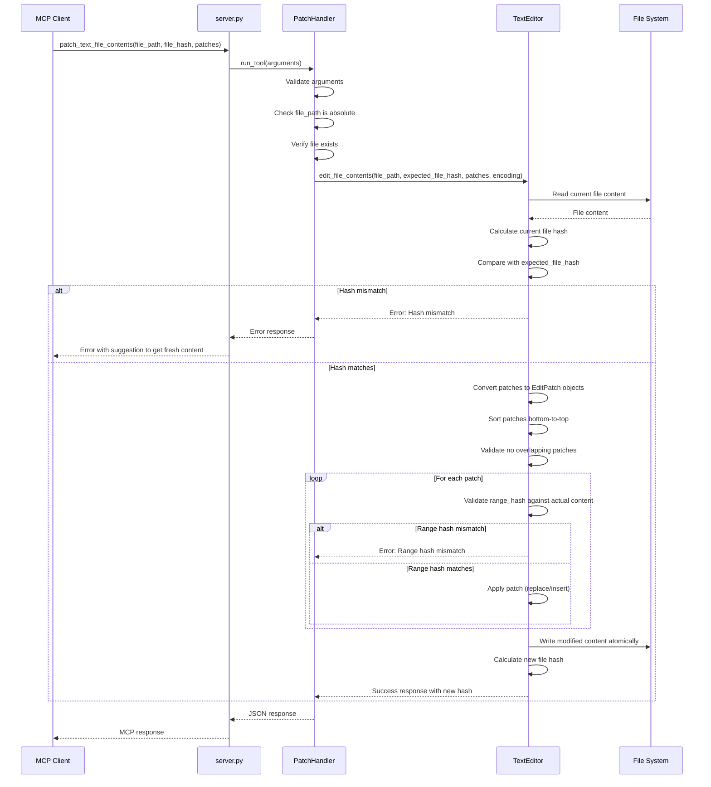

# MCP Text Editor API Flow Documentation

## Overview

This document details the execution flow for each MCP tool provided by the text editor server, showing how requests flow through the system components.

## General Request Flow

All tool calls follow this general pattern:

```
MCP Client → server.py → Handler → TextEditor → File System → Response Chain
```

1. **MCP Client** sends JSON-RPC request over stdio
2. **Server** (`server.py`) receives and routes to handler
3. **Handler** validates input and delegates to core logic
4. **TextEditor** performs file operations with safety checks
5. **Response** propagates back through the chain

## Tool-Specific Flows

### `patch_text_file_contents`

The most complex operation, applying targeted modifications to files.

#### Flow Details



#### Key Code Locations
- **Entry**: `server.py:65` → `patch_file_handler.run_tool()`
- **Validation**: `handlers/patch_text_file_contents.py:74-92`
- **Core Logic**: `text_editor.py:223` → `edit_file_contents()`
- **Hash Validation**: `text_editor.py:297-305`
- **Patch Processing**: `text_editor.py:310-340`

### `get_text_file_contents`

Retrieves file content with optional line range specification.

#### Flow Details


#### Key Code Locations
- **Entry**: `server.py:55` → `get_contents_handler.run_tool()`
- **Core Logic**: `text_editor.py:185` → `read_file_contents()`
- **File Reading**: `text_editor.py:98` → `_read_file()`

### `create_text_file`

Creates new files with specified content.

#### Flow Details


### `append_text_file_contents`

Appends content to the end of existing files.

#### Flow Details


### `insert_text_file_contents`

Inserts content at specific line positions.

#### Flow Details


### `delete_text_file_contents`

Deletes specified line ranges from files.

#### Flow Details


## Error Handling Flows

### Hash Mismatch Detection

```
File Operation Request
        ↓
Read Current File Content
        ↓
Calculate Current Hash
        ↓
Compare with Expected Hash
        ↓
    [Mismatch?]
        ↓
Return Error with:
- Current hash
- Suggestion to use get_text_file_contents
- Helpful hint message
```

### Path Validation

```
File Path Input
        ↓
Check for ".." patterns
        ↓
Verify absolute path
        ↓
    [Invalid?]
        ↓
Return Error:
"Path traversal not allowed" or
"File path must be absolute"
```

### Encoding Errors

```
File Read Request
        ↓
Attempt read with specified encoding
        ↓
    [UnicodeDecodeError?]
        ↓
Return Error:
"Failed to decode file with {encoding} encoding"
```

## Performance Considerations

### Efficient File Reading
- Files read once per operation
- Line ranges extracted without loading entire file into memory
- Hash calculations performed on-demand

### Atomic Operations
- All write operations are atomic
- Temporary files not used (direct write)
- File locks not explicitly used (relies on OS-level atomicity)

### Memory Usage
- Large files processed line-by-line
- Content held in memory only during processing
- No persistent caching between requests

## Concurrency Model

### Thread Safety
- Each request handled independently
- No shared mutable state between requests
- File system provides isolation

### Conflict Resolution
- Hash-based optimistic concurrency control
- No explicit locking mechanism
- Client responsible for retry logic on conflicts